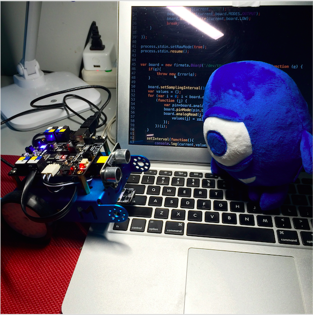

# 我的第一个 `Arduino` 项目

> 非常感谢 CNode 社区赠送的 mBot 机器人!



## 怎么玩

mBot 附带了非常方便的图形化界面 IDE ，也可以使用 Arduino IDE 来编程。但是我们工程师就是爱折（de）腾（se），
板子到手后连上 USB，装好驱动，用 `gort` 刷上 `firmata` 的固件，这样就可以通过 Node.js 来控制机器人了。

### 针脚和硬件的对应关系


**传感器**

- D2 红外接收器
- D3 红外发射器
- D12 超声波发射器
- A0(D14) - 左轨道传感器
- A1(D15) - 右轨道传感器
- A6(D20) - 光线传感器
- A7(D21) 按键

**电机**

- D4 左轮方向
- D5 左轮
- D6 右轮
- D7 右轮方向

**蜂鸣器**

- D8 蜂鸣器

**LED**

- D13 LED 指示器
- D13 LED 彩灯

## 使用说明

目前还只是一个 POC，用来探索各个针脚的功能和用法。

1\. 启动主程序

```sh
node index.js
```

2\. 使用键盘上的 `up` & `down` 切换针脚

3\. 使用 `left` & `right` 调整阵脚的高低电平 


## 参考资料

### 针脚按照读取模式分类

**INPUT (0)**

Pins: D2,D3,D4,D5,D6,D7,D8,D9,D10,D11,D12,D13,D14,D15,D16,D17,D18,D19

**OUTPUT (1)**

Pins: D2,D3,D4,D5,D6,D7,D8,D9,D10,D11,D12,D13,D14,D15,D16,D17,D18,D19

**ANALOG (2)**

Pins: D14,D15,D16,D17,D18,D19,D20,D21

**PWM (3)**

Pins: D3,D5,D6,D9,D10,D11

**SERVO (4)**

Pins: D2,D3,D4,D5,D6,D7,D8,D9,D10,D11,D12,D13,D14,D15,D16,D17,D18,D19

**SHIFT (5)**

Pins: N/A

**I2C (6)**

Pins: D18,D19

**ONEWIRE (7)**

**Pins: N/A

**STEPPER (8)**

Pins: N/A

**IGNORE (127)**

Pins: N/A

**UNKOWN (16)**

Pins: N/A

### 术语表

- Arduino
- Analog
- GND
- I2C
- IR
- LED
- Onewire
- PCB
- PWM
- Servo
- Stepper
- VBUS
- VCC

### 连线


### CPU 架构图

[](reference/atmel_datasheet.pdf)

### PCB 设计图

[](reference/mCore.pdf)

