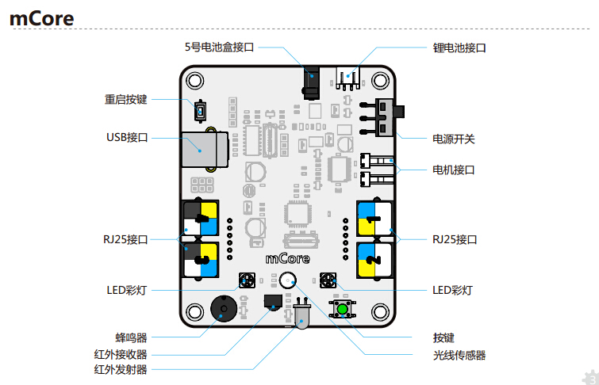
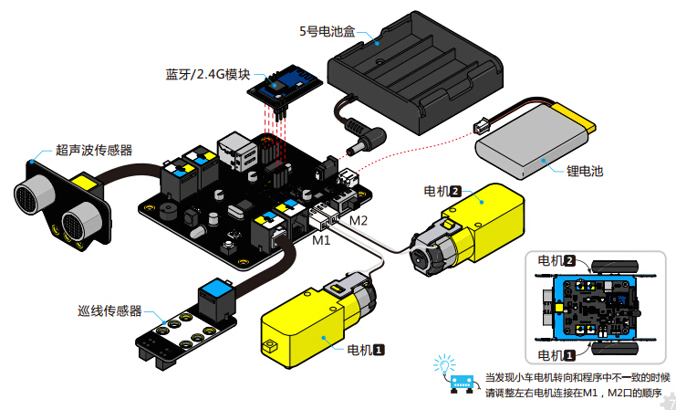
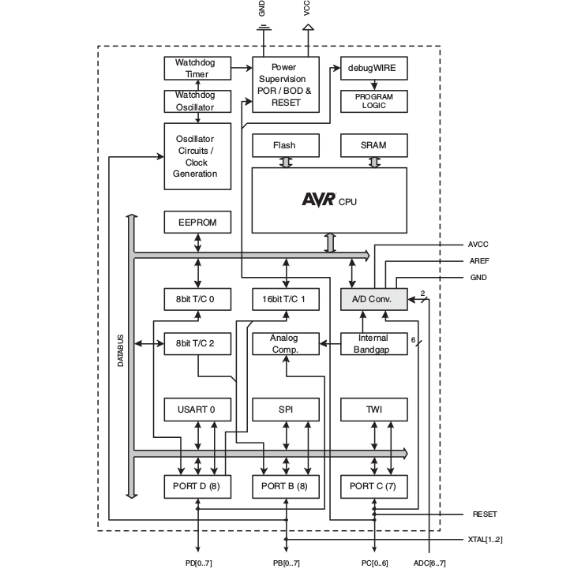
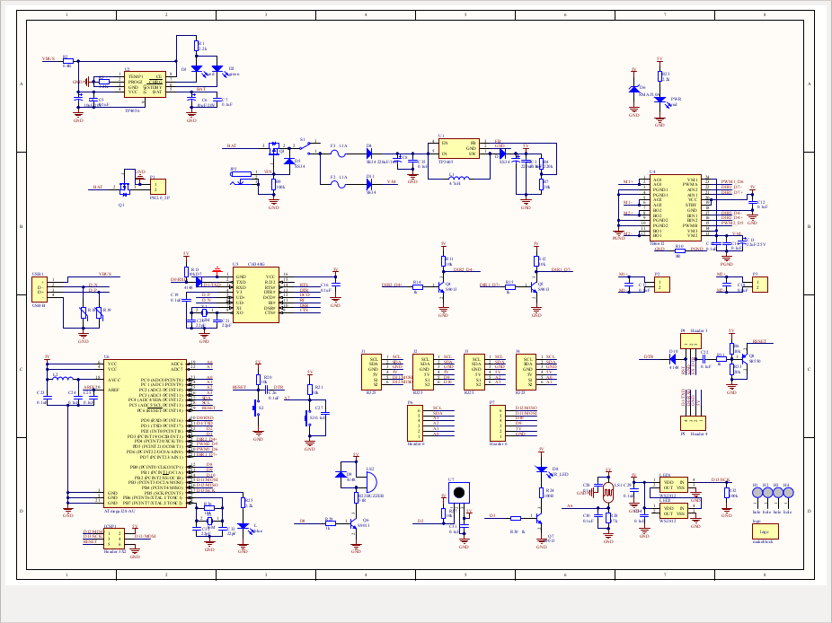

# 我的第一个 `Arduino` 项目

> 使用到了 Makeblock 生产的 mCore 开发板，非常感谢 CNode 社区的活动。



## 怎么玩

板子到手后连上 USB，用 `gort` 刷了 `firmata` 的固件，这样就可以通过 Node.js 控制，而且免去装 IDE 的烦恼。

**官方手册的组装图**



## mCore 是怎样的一块板子

### 电器特性

### 针脚按照读取模式分类

**Mode: INPUT (0)**

Pins: D2,D3,D4,D5,D6,D7,D8,D9,D10,D11,D12,D13,D14,D15,D16,D17,D18,D19

**Mode: OUTPUT (1)**

Pins: D2,D3,D4,D5,D6,D7,D8,D9,D10,D11,D12,D13,D14,D15,D16,D17,D18,D19

**Mode: ANALOG (2)**

Pins: D14,D15,D16,D17,D18,D19

**Mode: PWM (3)**

Pins: D3,D5,D6,D9,D10,D11

**Mode: SERVO (4)**

Pins: D2,D3,D4,D5,D6,D7,D8,D9,D10,D11,D12,D13

**Mode: SHIFT (5)**

Pins: N/A

**Mode: I2C (6)**

Pins: D18,D19

**Mode: ONEWIRE (7)**

**Pins: N/A

**Mode: STEPPER (8)**

Pins: N/A

**Mode: IGNORE (127)**

Pins: N/A

**Mode: UNKOWN (16)**

Pins: N/A

### 针脚和硬件的对应关系

### 红外装置

- D2 - 红外接受
- D3 - 红外发送

### 光线

- D10 - 光线传感器

### 行进装置

- D4 - 左轮方向
- D5 - 左轮
- D6 - 右轮
- D7 - 右轮方向

### 蜂鸣器

- D8 - 蜂鸣器

### 超声测距

- D12 - 超声波发射器

### LED

- D13 - LED

### 传感器

- A0(D14) - 左轨道传感器
- A1(D15) - 右轨道传感器

## 使用说明

> index.js 目前只是一个 POC，用来探索各个针脚的功能和用法。

1\. 启动主程序

```sh
node index.js
```

2\. 使用键盘上的 `up` & `down` 切换针脚

3\. 使用 `left` & `right` 调整阵脚的高低电平 

### 术语表

- Arduino
- Makeblock
- PCB
- Analog
- PWM
- Servo
- I2C
- Onewire
- Stepper
- IR
- LED
- VBUS
- GND
- VCC

### CPU 架构图

[](reference/atmel_datasheet.pdf)

### PCB 设计图

[](reference/mCore.pdf)

